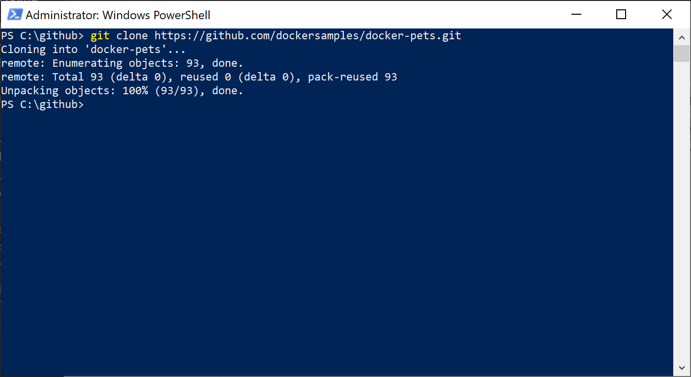
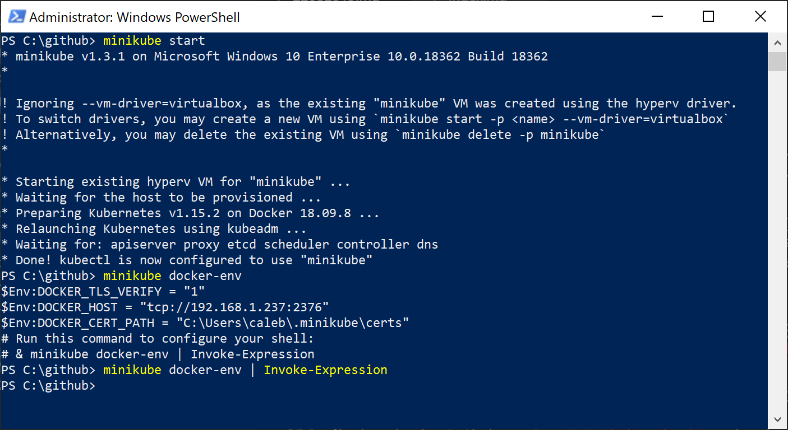
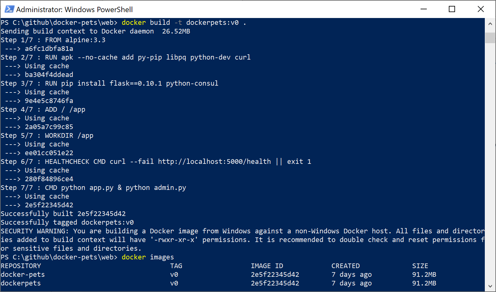

# 22 Aug 2019

Using [Kubernetes](https://kubernetes.io/), a container orchestration service, and [Docker](https://www.docker.com/) as the platform for containers. Using this Kubernetes, I am able to deploy a service that is easy to scale and reliable. The Docker image that I used is the [docker-pets](https://github.com/dockersamples/docker-pets), which hosts a web page that displays images of pets. On the website it also shows which container is hosting the web page, making it a good demo to show the scalability of Docker contianers. 

## How I did it
First download the [docker-pets](https://github.com/dockersamples/docker-pets) image, or using the command `git clone https://github.com/dockersamples/docker-pets.git`



Next, start minikube using `minikube start` and enter the Docker environment using `minikube docker-env` and `minikube docker-env | Invoke-Expression`



Afterwards, build the image using `docker build -t dockerpets:v0 .` in the docker-pets/web folder. 



Afterwards, create a yaml file for the deployment.

###deployment.yml
> Referenced a tutorial by James Quigley (https://www.youtube.com/watch?v=1xo-0gCVhTU)

```
---
kind: Service
apiVersion: v1
metadata:
  name: petservice
spec:
  selector:
    app: docker-pets
  ports:
    - protocol: "TCP"
      # Port accessible inside cluster
      port: 8080
      # Port to forward to inside the pod
      targetPort: 5000
      # Port accessible outside cluster
      nodePort: 30000
  type: LoadBalancer

---
apiVersion: extensions/v1beta1
kind: Deployment
metadata:
  name: docker-pets
spec:
  replicas: 5
  template:
    metadata:
      labels:
        app: docker-pets
    spec:
      containers:
        - name: docker-pets
          image: docker-pets:v0
          imagePullPolicy: IfNotPresent
          ports:
            - containerPort: 5000
```